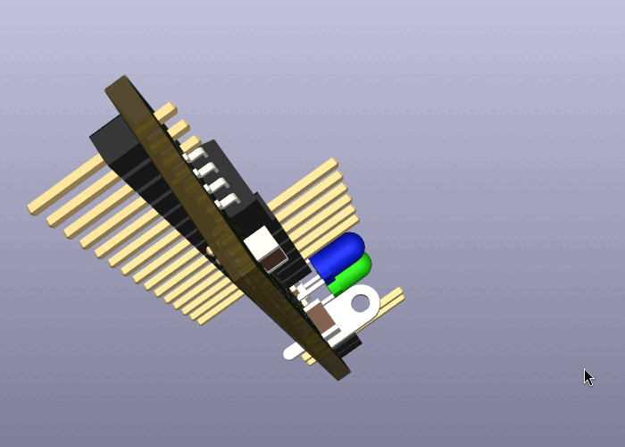

# another watch dog for ESP32




le code est pour l'IDE arduino-ide 2

le code a inclure dans votre projet esp32 :


```cpp
#define WATCHDOG_EXT         25 // io esp322
//config watchdog
extern bool watchdogState ;
extern unsigned long previousMillisWD ;
extern const long intervalWD ;

void setup(){...}

void loop() {
  // watchdog exterieur creer un clignotment <1.6hz
 unsigned long currentMillisWD = millis();
 
   if (currentMillisWD - previousMillisWD >= intervalWD) {
    previousMillisWD = currentMillisWD;
    watchdogState = !watchdogState;  // Inverse l'état
    digitalWrite(WATCHDOG_EXT, watchdogState);
  }
  
  ....
  
  }
  ```
  
  # programmation ISP arduino
  
  vous devez configurer arduino-ide avec un arduino programmer en ISP
  
  file > example > arduinoISP
  
  configurer arduino IDE  pour avoir le tiny85
  File > preference 
  *additional board manager : https://raw.githubusercontent.com/damellis/attiny/ide-1.6.x-boards-manager/package_damellis_attiny_index.json
  *
  
  ## tools 
  * board : attiny85
  * clock 1MhZ
  * programmer : arduino as ISP
  *
  
  ### première utilisation attiny85
  * ne souder que le attiny85 et les pin de programmation
  * tool > burn bootloader
  * ca devrait fonctionner pour le projet
  

# production jlcpcb

aller dans le dossier : 
    aattiny_wdg/attiny/production/
    
    pour le pcb seul prendre attiny.zip et faire un devis directement sur le site de jlpcb ou pcbway vous recevrez vos pcb a souder chez vous
    
    les autre fichiers sont utiles si vous voulez produire le pcb complet ave composant
    
    # 