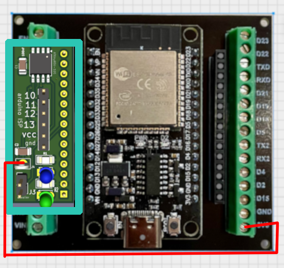

# Another ATtiny85 Watchdog for ESP32


Ce projet fournit un **watchdog externe** pour ESP32, compatible avec **Arduino IDE 2.x**.

---





## 🔧 Code à inclure dans votre projet ESP32

```cpp
#define WATCHDOG_EXT         25 // IO ESP32

// Configuration du watchdog
extern bool watchdogState;
extern unsigned long previousMillisWD;
extern const long intervalWD;

void setup() {
  unsigned long previousMillisWD = 0; 
const long intervalWD = 200;  //clignotement 500 >1.6hz
bool watchdogState = true;
}

void loop() {
  // Watchdog externe créant un clignotement < 1.6 Hz
  unsigned long currentMillisWD = millis();

  if (currentMillisWD - previousMillisWD >= intervalWD) {
    previousMillisWD = currentMillisWD;
    watchdogState = !watchdogState;  // Inverse l'état
    digitalWrite(WATCHDOG_EXT, watchdogState);
  }

  // ... reste de votre code
}
```

---

# 🔌 Programmation ISP de l'ATtiny85

Pour programmer l'ATtiny85, vous devez utiliser **Arduino comme ISP**. NE SURTOUT PAS CONNECTEZ la carte a lesp32 pendant la programmation
'''
| Arduino Uno | ATtiny85 (broche physique) | Sérigraphie | Fonction |
| ----------- | -------------------------- | ----------- | -------- |
| **10**      | 1                          | **P5**      | RESET    |
| **11**      | 5                          | **P0**      | MOSI     |
| **12**      | 6                          | **P1**      | MISO     |
| **13**      | 7                          | **P2**      | SCK      |
| **5V**      | 8                          | **VCC**     | Alim +5V |
| **GND**     | 4                          | **GND**     | Masse    |
'''

## 1. Charger ArduinoISP

Dans l'IDE Arduino :

* *File > Examples > ArduinoISP*
* Téléversez sur votre Arduino UNO/Nano (le programmateur).

## 2. Ajouter la carte ATtiny85

* *File > Preferences*
* Dans **Additional board manager URLs**, ajoutez :

```
https://raw.githubusercontent.com/damellis/attiny/ide-1.6.x-boards-manager/package_damellis_attiny_index.json
```

Ensuite :

* *Tools > Board > Boards Manager*
* Recherchez **attiny** et installez.

## 3. Configuration

Dans *Tools* :

* **Board** : ATtiny85
* **Clock** : 1 MHz (interne)
* **Programmer** : Arduino as ISP

###  Première utilisation de l'ATtiny85

1. Ne soudez que l'ATtiny85 et les pins de programmation.
2. *Tools > Burn Bootloader* (installe les fuses corrects).
3. Votre ATtiny85 est maintenant prêt pour le projet.

 * fichier .ino >   aattiny_wdg/attiny_watchdog/attiny_watchdog.ino
 * vous pouvez soudez le reste des composants ! et le mettre en place
---

# 🏭 Production JLCPCB

Rendez-vous dans :

```
aattiny_wdg/attiny/production/
```

## ✔ Pour fabriquer uniquement le PCB

Utilisez **attiny.zip**, puis :

* envoyez-le sur JLCPCB ou PCBWay
* vous recevrez les PCB nus, à souder vous-même

## ✔ Pour la production complète (avec composants)

Les autres fichiers du dossier sont prévus pour l'assemblage automatisé.

---
